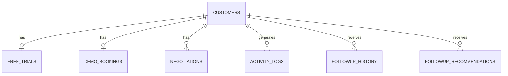

# FlowCRM AI — AI-Assisted Sales CRM

*(GitHub repository: `AI_CRM`)*

A full-stack CRM for tracking companies moving through a sales pipeline (Lead → Trial → Demo Booked → Negotiation → Closed Won), managing follow-ups, and viewing per-customer activity history. An offline AI job (Google Gemini) analyzes each customer's trial usage, activity, and follow-up history and writes a "next best action" recommendation back into the database, which the dashboard then displays.

> **Note on accuracy:** This README was written by inspecting the actual source code in `frontend/` and `backend/`, not by trusting feature descriptions in a prompt. Every feature below is labeled **Implemented**, **Partially implemented**, or **Not implemented / mock UI** based on what the code actually does. See [Known Limitations](#known-limitations) and [Discrepancies Found](#discrepancies-found) for a full honesty pass.

---

## Table of Contents

1. [Project Overview](#project-overview)
2. [Key Features](#key-features)
3. [Screenshots](#screenshots)
4. [Live Demo](#live-demo)
5. [Tech Stack](#tech-stack)
6. [Architecture](#architecture)
7. [Repository Structure](#repository-structure)
8. [Frontend Architecture](#frontend-architecture)
9. [Backend Architecture](#backend-architecture)
10. [API Documentation](#api-documentation)
11. [Database Design](#database-design)
12. [Authentication & Authorization](#authentication--authorization)
13. [Role-Based Access](#role-based-access)
14. [Data Flow Examples](#data-flow-examples)
15. [Environment Variables](#environment-variables)
16. [Local Development Setup](#local-development-setup)
17. [Production Build](#production-build)
18. [Deployment](#deployment)
19. [Testing](#testing)
20. [Error Handling](#error-handling)
21. [Security Considerations](#security-considerations)
22. [Performance Considerations](#performance-considerations)
23. [Design Decisions](#design-decisions)
24. [Challenges & Solutions](#challenges--solutions)
25. [Future Improvements](#future-improvements)
26. [Known Limitations](#known-limitations)
27. [Discrepancies Found](#discrepancies-found)
28. [Git Workflow](#git-workflow)
29. [Code Quality & Best Practices](#code-quality--best-practices)
30. [Resume Description](#resume-description)
31. [Interview Talking Points](#interview-talking-points)
32. [Glossary](#glossary)
33. [License](#license)
34. [Contributing](#contributing)

---

## Project Overview

**Problem it addresses:** A B2B SaaS sales team running free trials needs to know, at a glance, which trial accounts are worth a follow-up call, which need a nudge email, and which are ready for a demo or a pricing negotiation — instead of manually reading through login logs and activity history for every account.

**What it does:** FlowCRM AI centralizes customer/company records, shows them on a five-stage sales pipeline board, and surfaces a prioritized follow-up list per customer. A separate AI job reads each customer's trial engagement, past activity, and follow-up history, and asks Google Gemini to produce a single recommended next action (call, email, or meeting) with a priority, a confidence score, and an estimated conversion probability. That output is stored and shown alongside the customer's record.

**Intended users:** A sales **Manager** (sees the full pipeline and all companies) and individual **Sales Representatives** (see only the accounts assigned to them via a numeric rep ID).

**What's technically interesting about the implementation:**
- The AI recommendation step is a deliberately **offline, batch-style job** rather than an inline API call — it is run as a standalone Node script, not on every page load, which avoids hammering the LLM API on every dashboard refresh.
- The Gemini prompt (`backend/src/services/ai_service.js`) is a long, rule-heavy prompt that explicitly constrains the model's output to a fixed enum of actions (`CALL` / `EMAIL` / `MEETING`), a fixed priority scale, and a strict JSON schema, with a `validateRecommendation` function that sanitizes anything the model returns before it's saved.
- The pipeline board groups customers into five fixed stages purely in application code (the `getPipelineStages` service function buckets rows in JavaScript after a single SQL query), rather than five separate queries.

## Key Features

### CRM Management — **Implemented**
- Company/customer directory with industry, size, location, and an AI-derived score (`GET /api/dashboard/companies`)
- Full company detail view: contact info, trial status/usage, activity timeline, follow-up history, and the latest AI recommendation (`GET /api/dashboard/company/:customerId`)
- Client-side search/filter over the loaded companies list, with "show more / show less" pagination of the visible rows

### Sales Pipeline — **Implemented**
- Five-stage board (Lead, Trial, Demo Booked, Negotiation, Closed Won) built from `customers.current_stage`
- Manager view (all active customers) and Sales Rep view (filtered by `sales_rep_id`)
- Clicking a deal opens the company detail view; a stage's "View All" opens a dedicated stage page

### Follow-ups — **Implemented**
- Follow-up list driven by AI-generated recommendations with status `Pending`, sorted by priority then recency, limited to the top 5
- Per-follow-up action buttons for Call / Email / **Schedule Demo** / **Schedule Negotiation**
- Demo scheduling — **Implemented**: submits to a real backend endpoint (`POST /api/demo-bookings`) with duplicate-booking and missing-customer checks
- Negotiation scheduling — **Not implemented on the backend**: the form calls `POST /api/negotiation-meetings`, which does not exist as a route in this codebase, so submitting it will fail

### Dashboard — **Implemented**
- Manager dashboard: trial user count, conversion rate, revenue potential (estimated from AI conversion probabilities × a fixed ₹999 plan price), and pending-meeting count, all computed live from SQL aggregates
- Sales Rep dashboard: same `stats` endpoint reused, but the UI labels ("My Trial Accounts", "Quota Progress", etc.) expect fields (`trialAccounts`, `quotaProgress`, `meetingsToday`) that the API does not return — see [Discrepancies Found](#discrepancies-found)

### User Roles — **Implemented (UI-level only)**
- Login screen offers "Manager" (no credentials) or "Sales Representative" (enter a numeric rep ID, no password)
- Role and rep ID are held only in React state — there is no persisted session and no server-side check of who is making a request

### Activities — **Partially implemented**
- Activity timeline UI exists and renders per-customer activity from `getCompanyDetails`
- The standalone `Activities` page calls `GET /api/dashboard/activities`, which does not exist on the backend, so that page will always show its error state in the current codebase

### AI Recommendations — **Implemented (as an offline script, not an API-triggered feature)**
- `node test_ai.js` runs `generateRecommendations()`, which pulls every active customer, builds a detailed context object (trial data, demo/negotiation bookings, recent activity, follow-up history), sends it to Gemini, validates the JSON response, and stores it in `followup_recommendations`
- The dashboard only **reads** recommendations that already exist in the database; there is no "Generate recommendation" button or endpoint in the app itself

### AI Copilot Chat Widget — **Not implemented as AI** (UI mock)
- A floating chat widget exists and looks like an AI assistant, but its replies are hardcoded keyword-matched strings in `Copilot.jsx` (a code comment marks this as a placeholder: *"Replace this section with Gemini later"*). No LLM call is made from this component.

### AI-Generated Emails — **Not implemented** (UI mock)
- The "Generate Email" button opens a modal that always shows the same hardcoded example email text (`EmailModal.jsx`). No email content is actually generated.

### Reports & Insights — **Not implemented** (static mock UI, and not reachable in normal navigation)
- `SalesReports.jsx` renders hardcoded bar heights in elements literally classed `fake-chart`
- `Insights.jsx` renders two hardcoded example companies with fixed scores
- Neither page is imported/rendered from `App.jsx`'s active navigation for a Sales rep in a way a user can normally reach (see [Known Limitations](#known-limitations))

### Notifications — **Partially implemented**
- The bell icon opens a panel showing the top 3 pending follow-ups (real data, from `activitiesAPI.getFollowups`)
- There is no push/real-time delivery — it is a manual fetch on login

### Meetings — **Not implemented** (static mock UI)
- The dedicated "Meetings" page renders a hardcoded list of three example meetings; it is not wired to any API

## Screenshots

No screenshots currently exist in the repository. Recommended structure:

```text
docs/
└── screenshots/
    ├── login.png
    ├── dashboard-manager.png
    ├── dashboard-sales-rep.png
    ├── pipeline.png
    ├── company-details.png
    └── followups.png
```

```markdown
## Screenshots

### Login


### Manager Dashboard


### Sales Pipeline


### Company Details


### Follow-ups with AI Recommendations

```

**Most valuable screenshots for a recruiter, in priority order:** (1) the pipeline board, since it best conveys the CRM's core concept at a glance, (2) the company detail view showing the AI recommendation, since it demonstrates the AI feature, (3) the manager dashboard with live stats, (4) the follow-up list with the schedule-demo action, (5) the login/role-selection screen, and (6) the sales-rep filtered pipeline to show the role distinction.

## Live Demo

**Live demo: Coming soon**

No live demo link is published in this documentation. However, the frontend's API client (`frontend/src/services/api.js`) has a Render URL hardcoded as its backend base:

```js
const API_BASE_URL = "https://ai-crm-83jh.onrender.com/api";
```

This indicates the **backend has been deployed to Render** at some point during development. This documentation does not independently verify whether that deployment is currently live — treat it as evidence found in source, not a guaranteed working link. No frontend deployment configuration (e.g. `vercel.json`, `netlify.toml`) exists in the repository, so frontend hosting could not be verified from the repository.

## Tech Stack

| Layer | Technology | Why |
|---|---|---|
| Frontend | React 19, Vite | Fast dev server, component-based UI, no build-tool boilerplate |
| Frontend state | React `useState`/`useEffect` only | App is small enough that a dedicated state library wasn't needed |
| Styling | Plain CSS (`App.css`, `index.css`) + inline styles | No CSS framework or CSS-in-JS library is used |
| Backend | Node.js, Express 5 | Minimal, well-understood REST framework |
| Database | PostgreSQL via `pg` | Relational data (customers, trials, follow-ups) with real relationships between records |
| Database hosting | Supabase-hosted Postgres (per the project's environment configuration) | Managed Postgres with connection pooling |
| AI | Google Gemini (`@google/genai` SDK) | Generates structured, constrained JSON recommendations from a rules-heavy prompt |
| API style | REST (JSON over HTTP) | Simple `fetch`-based frontend integration |
| Auth | **None implemented** | See [Authentication & Authorization](#authentication--authorization) |
| CORS | `cors` npm package (open, no origin restriction) | Currently permissive; see [Security Considerations](#security-considerations) |
| Dev tooling | `nodemon` (backend), ESLint (frontend) | Auto-restart on change; lint rules for React |
| Version control | Git, GitHub | — |
| Deployment | Render (backend, per hardcoded URL) | Frontend hosting not verifiable from the repository |

The `openai` npm package is listed in `backend/package.json` but is never imported anywhere in the codebase — it is a dead dependency. The actual AI calls go through `@google/genai`, and the environment variable that holds the Google API key is (confusingly) named `OPENAI_API_KEY`.

## Architecture

```text
┌───────────────────────────┐
│      React Frontend       │
│         (Vite)            │
│  - Local component state  │
│  - No router library       │
└─────────────┬─────────────┘
              │ REST (fetch), JSON
              ▼
┌───────────────────────────┐
│      Express Backend      │
│  routes → controllers →   │
│         services          │
└─────────────┬─────────────┘
              │ SQL (node-postgres)
              ▼
┌───────────────────────────┐
│   PostgreSQL (Supabase)   │
└───────────────────────────┘

  Offline / manual process:
┌───────────────────────────┐        ┌────────────────────┐
│ node test_ai.js           │──────▶ │  Google Gemini API  │
│ (ai_service.js)           │◀────── │ (@google/genai)     │
└─────────────┬─────────────┘        └────────────────────┘
              │ writes recommendations
              ▼
┌───────────────────────────┐
│   PostgreSQL (Supabase)   │
└───────────────────────────┘
```

**Frontend responsibilities:** render UI, hold session/role state locally, call the REST API, format and display responses, show loading/error states per component.

**Backend responsibilities:** expose REST endpoints, run SQL queries against Postgres, shape the pipeline-stage grouping in application code, and (via the separate AI service) call Gemini and persist its output.

**API communication:** all real traffic is plain `fetch` calls to `https://ai-crm-83jh.onrender.com/api/...` (hardcoded), returning JSON. There is no GraphQL, no WebSocket, and no polling.

**Database interaction:** every service function uses parameterized SQL through a single shared `pg.Pool` instance (`backend/src/config/database.js`) — no ORM.

**Authentication flow:** none — see [Authentication & Authorization](#authentication--authorization).

**Important controller/service relationships:** every controller is a thin try/catch wrapper around one or more service functions; controllers never touch the database directly. `dashboard_controller.js` → `dashboard_service.js`; `demo_controller.js` → `demo_service.js`; the AI batch script (`test_ai.js`) calls `ai_service.js` directly with no controller layer.

## Repository Structure

```text
AI_CRM/
├── README.md                     # Generic Vite/setup instructions (superseded by this file)
│
├── backend/
│   ├── server.js                 # Entry point — loads dotenv, starts Express, listens on PORT
│   ├── list_models.js            # Standalone script: lists available Gemini models
│   ├── test_ai.js                # Standalone script: runs the AI recommendation batch job
│   ├── package.json
│   └── src/
│       ├── app.js                # Express app: CORS, JSON body parsing, route mounting
│       ├── config/
│       │   └── database.js       # pg.Pool connection using env vars
│       ├── routes/
│       │   ├── dashboard_routes.js
│       │   └── demo_routes.js
│       ├── controllers/
│       │   ├── dashboard_controller.js
│       │   └── demo_controller.js
│       └── services/
│           ├── dashboard_service.js   # All dashboard/pipeline/company SQL queries
│           ├── demo_service.js        # Demo booking creation + validation
│           └── ai_service.js          # Gemini prompt building, calling, validating, saving
│
└── frontend/
    ├── index.html
    ├── vite.config.js
    ├── package.json
    ├── public/
    │   ├── favicon.svg
    │   └── icons.svg
    └── src/
        ├── main.jsx               # ReactDOM root render
        ├── App.jsx                # All top-level state, view routing (no router library), layout
        ├── App.css / index.css
        ├── services/
        │   └── api.js             # fetch wrappers grouped by resource (companies, pipeline, etc.)
        ├── pages/
        │   ├── Login.jsx
        │   ├── Dashboard.jsx
        │   ├── Companydetail.jsx
        │   ├── StageDetail.jsx
        │   ├── Meetings.jsx        # Static mock data
        │   ├── Activities.jsx
        │   ├── Insights.jsx        # Static mock data, not routed in App.jsx
        │   ├── Settings.jsx
        │   └── sales/
        │       ├── SalesDashboard.jsx
        │       └── SalesReports.jsx  # Static mock charts
        ├── components/
        │   ├── layout/
        │   │   ├── Sidebar.jsx
        │   │   └── Navbar.jsx
        │   ├── dashboard/
        │   │   ├── Hero.jsx
        │   │   ├── StatCard.jsx
        │   │   ├── Pipeline.jsx
        │   │   ├── Followups.jsx
        │   │   ├── CompaniesTable.jsx
        │   │   └── DemoBookings.jsx
        │   └── overlays/
        │       ├── Drawer.jsx               # Company quick-view side panel
        │       ├── CompanyModal.jsx         # "Add Company" form (UI only, doesn't persist)
        │       ├── EmailModal.jsx           # Hardcoded example email (not AI-generated)
        │       ├── Copilot.jsx              # Chat widget with hardcoded replies
        │       ├── DemoBookingForm.jsx      # Real POST to /api/demo-bookings
        │       ├── NegotiationBookingForm.jsx  # Posts to a non-existent endpoint
        │       ├── NotifyPanel.jsx
        │       └── Toast.jsx
        └── ...
```

There is no `models/`, `migrations/`, `middleware/`, or `tests/` directory anywhere in the backend — those layers are not present in this codebase.

## Frontend Architecture

**Pages** are top-level views rendered conditionally from `App.jsx`'s local state (`activePage`, `pageView`) — there is **no routing library** (no `react-router-dom` in `package.json`); navigation is done entirely by setting state and re-rendering.

**Components** are split into `layout/` (sidebar, navbar), `dashboard/` (stat cards, pipeline board, tables), and `overlays/` (modals, drawers, the chat widget, toasts) — a reasonably clean separation by role.

**Services / API layer:** `src/services/api.js` exports grouped fetch helpers (`companiesAPI`, `pipelineAPI`, `activitiesAPI`, `meetingsAPI`, `salesAPI`, `statsAPI`, `demoBookingAPI`), all built on one shared `fetchAPI()` wrapper that sets JSON headers and throws on non-2xx responses. Several components (`Followups.jsx`, `DemoBookingForm.jsx`, `NegotiationBookingForm.jsx`) bypass this layer and call the deployed backend URL directly with `fetch(...)` instead of going through `api.js`.

**State management:** local component state only (`useState`/`useEffect`); no Redux, Zustand, or Context API usage found.

**Routing/navigation:** manual — `App.jsx` holds `activePage` (`"dashboard" | "meetings" | "activities" | "reports" | "settings"`) and a separate `pageView` object for drill-down views (`"stage"` or `"company"`). Note that the sidebar can set `activePage` to `"companies"`, which has **no matching render branch** in `App.jsx` — see [Known Limitations](#known-limitations).

**Role-based rendering:** `App.jsx` computes `isSales = user?.role === "sales"` and conditionally renders `SalesDashboard` vs. `Dashboard`, different sidebar nav items, and different placeholder text — purely on the client.

**Forms:** `CompanyModal` (add company/lead — UI only, no persistence), `DemoBookingForm` and `NegotiationBookingForm` (both use plain controlled `<input type="date">` / `<input type="time">` fields, no form library).

**Modals/overlays:** `Drawer` (company quick view), `CompanyModal`, `EmailModal`, `Copilot`, `Toast`, `NotifyPanel` — all conditionally rendered based on boolean state flags held in `App.jsx` and passed down as props.

**Error handling:** every data-fetching component (`Dashboard`, `Pipeline`, `CompaniesTable`, `Activities`, `Companydetail`, `Followups`) follows the same `loading` / `error` / data pattern with a "Retry" button that re-runs the fetch.

**Loading states:** simple text ("Loading dashboard...", "Loading pipeline...") rather than skeleton loaders or spinners.

**Data flow (for a typical read):**

```text
User Interaction
      ↓
React Component (e.g. Dashboard.jsx)
      ↓
API Service (services/api.js) or direct fetch()
      ↓
HTTP Request → https://ai-crm-83jh.onrender.com/api/...
      ↓
Express Route → Controller → Service
      ↓
PostgreSQL (via pg.Pool)
      ↓
JSON Response
      ↓
React useState update
      ↓
Conditional re-render (loading → data / error)
```

## Backend Architecture

**Server entry point:** `backend/server.js` — loads environment variables with `dotenv`, imports the configured Express app from `src/app.js`, and starts listening on `process.env.PORT || 5000`.

**Routes → Controllers → Services layering:**

```text
Route (Express Router)
  ↓
Controller (req/res handling, try/catch, HTTP status codes)
  ↓
Service (SQL queries, business rules, external API calls)
  ↓
PostgreSQL / Gemini API
```

- **Routes** (`dashboard_routes.js`, `demo_routes.js`) only map HTTP verbs + paths to controller functions.
- **Controllers** (`dashboard_controller.js`, `demo_controller.js`) parse `req.params`/`req.body`, call the matching service function, and translate results/errors into HTTP responses. They contain no SQL.
- **Services** (`dashboard_service.js`, `demo_service.js`, `ai_service.js`) contain all SQL queries (via the shared `pg.Pool`) and, in `ai_service.js`, all Gemini prompt construction and response validation.

**Middleware:** `cors()` (open, default config — allows all origins) and `express.json()` (parses JSON request bodies). No authentication middleware, no request logging middleware, no rate limiting, and no centralized error-handling middleware — each controller handles its own errors individually.

**CORS:** enabled globally with no origin restriction (`app.use(cors())`), meaning any website can call this API from a browser.

**Database layer:** a single shared `pg.Pool` (`src/config/database.js`), configured from five separate `DB_*` environment variables. All queries are parameterized (`$1`, `$2`, ...) — no raw string interpolation of user input was found in the SQL.

**Environment configuration:** loaded once via `dotenv` in `server.js` (and separately in the two standalone scripts, `test_ai.js` and `list_models.js`, which each call `require("dotenv").config()` themselves since they're run outside the Express app).

## API Documentation

All routes are mounted under `/api` in `src/app.js`. There is also an unprefixed health-check route.

### Health Check

```http
GET /
```
**Description:** Confirms the server is running.
**Response:** `Backend is running!` (plain text)

### Dashboard

#### Get Dashboard Statistics
```http
GET /api/dashboard/stats
```
**Description:** Aggregate stats for the manager dashboard — trial user count, follow-up count, estimated revenue, and a conversion rate computed from active subscriptions ÷ trial users.
**Response `200`:**
```json
{
  "trialUsers": 42,
  "conversionRate": 12.5,
  "revenuePotential": 8500,
  "meetings": 7
}
```
**Errors:** `500` — `{ "message": "Failed to fetch dashboard statistics." }`

*Note: revenue potential is computed as `SUM((estimated_conversion_probability / 100) * 999)` across all follow-up recommendations — the ₹999 figure is a hardcoded assumed premium plan price found in a code comment, not a configured price.*

#### Get Leads
```http
GET /api/dashboard/leads
```
**Description:** All customers, with a concatenated full name.
**Response `200`:** array of `{ "customer_id": 1, "company_name": "...", "full_name": "..." }`
**Errors:** `500`

#### Get Trial Users
```http
GET /api/dashboard/trial-users
```
**Description:** Customers that have an associated free-trial row.
**Response `200`:** array of `{ "customer_id": 1, "company_name": "...", "full_name": "..." }`
**Errors:** `500`

#### Get AI Recommendations
```http
GET /api/dashboard/recommendations
```
**Description:** All stored follow-up recommendations, newest first, joined with the customer's company/contact name.
**Response `200`:** array of
```json
{
  "recommendation_id": 10,
  "customer_id": 1,
  "company_name": "InnovateX",
  "first_name": "...",
  "last_name": "...",
  "recommended_action": "Call the customer to understand low trial usage.",
  "priority": "High",
  "reason": "...",
  "confidence_score": 82,
  "estimated_conversion_probability": 61,
  "recommended_timeframe": "Within 24 hours",
  "status": "Pending",
  "generated_at": "2026-01-14T10:00:00.000Z"
}
```
**Errors:** `500`
*Note: this only returns recommendations already generated by the offline `test_ai.js` script — this route does not trigger new generation.*

#### Get Pipeline Stages
```http
GET /api/dashboard/pipeline
GET /api/dashboard/pipeline/:salesRepId
```
**Description:** Active customers grouped into the five fixed pipeline stages. The `:salesRepId` variant filters to that rep's customers.
**Response `200`:** array of exactly 5 objects:
```json
[
  { "name": "Lead", "deals": [ { "customer_id": 1, "company": "...", "note": "..." } ] },
  { "name": "Trial", "deals": [] },
  { "name": "Demo Booked", "deals": [] },
  { "name": "Negotiation", "deals": [] },
  { "name": "Closed Won", "deals": [] }
]
```
**Errors:** `500`

#### Get Companies Table
```http
GET /api/dashboard/companies
```
**Description:** All customers with their latest AI-derived conversion score (0 if no recommendation exists yet).
**Response `200`:** array of `{ "id": 1, "name": "...", "industry": "...", "size": "...", "location": "...", "score": 61 }`
**Errors:** `500`

#### Get Company Details
```http
GET /api/dashboard/company/:customerId
```
**Description:** Full detail bundle for one customer — contact info, trial data, recent activity, follow-up history, and the latest AI recommendation.
**Response `200`:**
```json
{
  "customer": { "customer_id": 1, "company_name": "...", "trial_start_date": "...", "..." : "..." },
  "activities": [ { "activity_type": "LOGIN", "activity_time": "...", "details": "..." } ],
  "followupHistory": [ { "followup_type": "CALL", "followup_status": "COMPLETED", "followup_date": "...", "notes": "..." } ],
  "recommendation": { "recommended_action": "...", "priority": "High", "..." : "..." }
}
```
**Errors:** `500` with `{ "message": "Customer not found." }` when the customer doesn't exist — note this is returned as HTTP 500, not 404 (see [Error Handling](#error-handling))

#### Get Follow-ups
```http
GET /api/dashboard/followups
GET /api/dashboard/followups/:salesRepId
```
**Description:** Top 5 pending follow-up recommendations, ordered by priority (High → Medium → Low) then most recent.
**Response `200`:** array of
```json
{
  "id": 10,
  "customer_id": 1,
  "company": "InnovateX",
  "action": "MEETING",
  "note": "Schedule a product demo focused on collaboration features.",
  "time": "Within 2 days",
  "meeting_type": "DEMO",
  "priority": "High"
}
```
**Errors:** `500`

### Demo Bookings

#### Create Demo Booking
```http
POST /api/demo-bookings
```
**Request body:**
```json
{ "customer_id": 1, "demo_date": "2026-08-20", "demo_time": "11:00" }
```
**Response `201`:**
```json
{
  "message": "Demo booked successfully.",
  "booking": { "demo_id": 5, "customer_id": 1, "demo_date": "2026-08-20", "demo_time": "11:00:00", "created_at": "..." }
}
```
**Errors:**
- `400` — missing `customer_id`, `demo_date`, or `demo_time`
- `404` — `{ "message": "Customer not found." }`
- `409` — `{ "message": "A demo is already booked for this customer." }`
- `500` — `{ "message": "Failed to create demo booking." }`

### Endpoints referenced by the frontend that do **not** exist on the backend

The frontend's `services/api.js` and several components call the following, none of which have a matching Express route in this codebase. Calling them from the UI will fail with an HTTP error:

| Frontend call | Expected endpoint | Status |
|---|---|---|
| `companiesAPI.create/update/delete/getById/getByName` | `POST/PUT/DELETE /api/companies*` | Not implemented |
| `pipelineAPI.moveDeal` | `POST /api/dashboard/pipeline/move` | Not implemented |
| `activitiesAPI.getActivities` | `GET /api/dashboard/activities` | Not implemented |
| `meetingsAPI.getAll/create` | `GET/POST /api/meetings` | Not implemented |
| `statsAPI.getConversionRate` | `GET /api/conversion-rate/stats` | Not implemented |
| `demoBookingAPI.getAll` | `GET /api/demo-bookings` | Not implemented (only `POST` exists) |
| `NegotiationBookingForm` submit | `POST /api/negotiation-meetings` | Not implemented |
| `Followups.jsx` bookings fetch | `GET /api/negotiation-meetings` | Not implemented |

## Database Design

**Database technology:** PostgreSQL (accessed via the `pg` driver's connection pool).

No migration files, schema files, or ORM model definitions exist anywhere in the repository. The schema below was reverse-engineered entirely from the SQL queries in `dashboard_service.js`, `demo_service.js`, and `ai_service.js` — column names, joins, and filters are accurate to what the code queries, but constraint details (exact types, indexes, `NOT NULL`, defaults) could not be verified from the repository and would need to be confirmed against the live Supabase schema.

**Tables referenced in code:**

| Table | Key columns observed in queries |
|---|---|
| `customers` | `customer_id` (PK), `company_name`, `first_name`, `last_name`, `email`, `industry`, `company_size`, `country`, `current_stage`, `status`, `sales_rep_id`, `created_at` |
| `free_trials` | `customer_id` (FK), `trial_start_date`, `trial_end_date`, `trial_status`, `days_active`, `current_streak`, `total_logins`, `projects_created`, `collaborators_invited`, `storage_used_gb`, `premium_features_used` |
| `demo_bookings` | `demo_id` (PK), `customer_id` (FK), `demo_date`, `demo_time`, `created_at` |
| `negotiations` | `customer_id` (FK), `negotiation_date`, `negotiation_time`, `created_at` — read by the AI service; no implemented API route writes to this table |
| `activity_logs` | `customer_id` (FK), `activity_type`, `activity_time`, `details` |
| `followup_history` | `customer_id` (FK), `followup_type`, `followup_status`, `followup_date`, `notes` |
| `followup_recommendations` | `recommendation_id` (PK), `customer_id` (FK), `recommended_action`, `followup_type`, `meeting_type`, `priority`, `reason`, `confidence_score`, `estimated_conversion_probability`, `recommended_timeframe`, `status`, `generated_at` |
| `subscriptions` | `subscription_status` — counted for the conversion-rate stat; no query in the codebase joins it to `customers` by a visible foreign key, so its relationship to `customers` could not be verified from the repository |



## Authentication & Authorization

**Not implemented.** There is no login endpoint, no user table referenced anywhere in the backend, no password hashing, no session mechanism, and no token (JWT or otherwise) issued or verified anywhere in the codebase.

The **Login** page (`frontend/src/pages/Login.jsx`) is a role picker only:
- Clicking "Login as Manager" sets `{ role: "manager", id: null }` in React state — no request is sent anywhere.
- Entering a numeric "Sales Rep ID" and clicking "Login as Sales Rep" sets `{ role: "sales", id: <that number> }` in React state — again, no request is sent, and the number is never validated against any real sales-rep record.

That role/ID is then used purely to decide what the UI shows and which query-string parameter (`salesRepId`) is appended to certain API calls, so the pipeline and follow-up queries can filter by that ID **at the database level** — but nothing on the backend verifies that the caller is actually authorized to see that rep's data. Any client can request any `salesRepId`'s data directly against the API.

```text
Login screen
 ↓
User picks a role (and, for sales, types any number)
 ↓
Value stored in React state only (lost on page refresh)
 ↓
UI conditionally renders manager vs. sales views
 ↓
API requests optionally include salesRepId as a URL param
 ↓
Backend filters SQL by that ID with no verification of who is asking
```

## Role-Based Access

| Role | What the UI shows | What is actually enforced server-side |
|---|---|---|
| Manager | Full pipeline, all companies, all follow-ups, "Companies"/"Meetings"/"Activities"/"Settings" nav | Nothing — a manager session is just the absence of a `salesRepId` param |
| Sales Rep | Pipeline/follow-ups/companies filtered by the entered rep ID, "My Companies"/"My Meetings" labels | Nothing — the backend trusts whatever `salesRepId` is passed in the URL |

Permissions are a **presentation-layer convenience**, not a security boundary, in the current implementation.

## Data Flow Examples

### Viewing the manager dashboard
```text
Dashboard.jsx mounts
 ↓
statsAPI.getDashboardStats()
 ↓
GET /api/dashboard/stats
 ↓
dashboardController.getDashboardStats → dashboardService.getDashboardStats
 ↓
4 SQL queries (trial count, pending follow-ups, revenue estimate, active subscriptions)
 ↓
JSON { trialUsers, conversionRate, revenuePotential, meetings }
 ↓
React state → StatCard components render
```

### Viewing a company's detail page
```text
User clicks a company row / pipeline deal
 ↓
App.jsx: viewCompany(customer_id) → pageView = { type: "company", customer_id }
 ↓
CompanyDetail.jsx mounts, calls companiesAPI.getCompanyDetails(customerId)
 ↓
GET /api/dashboard/company/:customerId
 ↓
4 SQL queries (customer+trial join, activity_logs, followup_history, latest recommendation)
 ↓
JSON { customer, activities, followupHistory, recommendation }
 ↓
React renders contact info, trial status, usage stats, activity timeline, AI recommendation
```

### Scheduling a demo (the one real write-path in the app)
```text
User clicks "Schedule Demo" on a MEETING/DEMO follow-up
 ↓
DemoBookingForm.jsx collects date + time
 ↓
POST /api/demo-bookings { customer_id, demo_date, demo_time, sales_rep_id }
 ↓
demoController.createDemoBooking → demoService.createDemoBooking
 ↓
Checks customer exists → checks no existing booking → INSERT INTO demo_bookings
 ↓
201 response with the created booking
 ↓
onSuccess() callback re-fetches the follow-up list
```

### Generating AI recommendations (offline process, not triggered from the UI)
```text
Developer runs: node test_ai.js
 ↓
ai_service.generateRecommendations()
 ↓
DELETE FROM followup_recommendations (dev-only reset, per code comment)
 ↓
For each active customer: gather trial/demo/negotiation/activity/history context
 ↓
Build a long rules-based prompt → call Gemini (gemini-3.5-flash-lite) with retry logic
 ↓
Parse + validate the JSON response (clamp scores, enforce enums)
 ↓
INSERT INTO followup_recommendations
 ↓
Dashboard's GET /api/dashboard/recommendations and /followups later read these rows
```

## Environment Variables

| Variable | Purpose | Required |
|---|---|---|
| `PORT` | Backend HTTP server port | No — defaults to `5000` |
| `DB_HOST` | PostgreSQL host | Yes |
| `DB_PORT` | PostgreSQL port | Yes |
| `DB_DATABASE` | PostgreSQL database name | Yes |
| `DB_USER` | PostgreSQL user | Yes |
| `DB_PASSWORD` | PostgreSQL password | Yes |
| `OPENAI_API_KEY` | **Actually a Google Gemini API key**, used by the `@google/genai` client in `ai_service.js` / `list_models.js` | Yes, for AI features |

No `.env.example` file exists in the repository. **Recommended addition:**

```env
PORT=5000
DB_HOST=your-db-host
DB_PORT=5432
DB_DATABASE=your-db-name
DB_USER=your-db-user
DB_PASSWORD=your-db-password
OPENAI_API_KEY=your-gemini-api-key
```

> ⚠️ A working `backend/.env` with real credentials exists in the project source and is correctly excluded by `backend/.gitignore` (`.env` was never committed to git history — verified against the full commit log). If those credentials have ever left your local machine (e.g. shared in a zip archive, chat log, or ticket), rotate the database password and the Gemini API key before publishing this repository.

The frontend has **no environment variables** — its API base URL is hardcoded directly in `src/services/api.js`.

## Local Development Setup

**Prerequisites:** Git, Node.js, npm, and access to a PostgreSQL database (the project was built against Supabase).

**1. Clone**
```bash
git clone https://github.com/Shubhamita2005/AI_CRM.git
cd AI_CRM
```

**2. Backend**
```bash
cd backend
npm install
# create a .env file (see Environment Variables above)
npm run dev      # nodemon, auto-restarts on change
# or: npm start   # plain node
```
The backend listens on `http://localhost:5000` by default (or `PORT` if set).

**3. Frontend**
```bash
cd frontend
npm install
npm run dev
```
Vite's dev server runs on `http://localhost:5173` by default.

**4. Point the frontend at your local backend**

The frontend currently hardcodes the deployed Render URL in `src/services/api.js`:
```js
const API_BASE_URL = "https://ai-crm-83jh.onrender.com/api";
```
To run against your local backend instead, temporarily change this to `http://localhost:5000/api` (and similarly update the direct `fetch()` calls in `Followups.jsx`, `DemoBookingForm.jsx`, and `NegotiationBookingForm.jsx`, which also hardcode the same Render URL rather than importing `API_BASE_URL`).

**5. (Optional) Generate AI recommendations**
```bash
cd backend
node test_ai.js
```
Requires `OPENAI_API_KEY` (Gemini key) and a populated `customers` table.

## Production Build

```bash
cd frontend
npm run build
```
This runs `vite build`; the production-ready static assets are output to `frontend/dist/`. `npm run preview` serves that build locally for a final check. The backend has no build step — `npm start` runs `server.js` directly with plain Node.

## Deployment

**Backend:** deployed to **Render** at some point (confirmed by the hardcoded `https://ai-crm-83jh.onrender.com` in the frontend source — not by a `render.yaml` or similar config file, since none exists in the repo). Deployment there was most likely done by connecting the GitHub repository directly through Render's dashboard, with `npm install` as the build command and `npm start` as the start command, and the same environment variables listed above configured in Render's dashboard.

**Frontend:** no deployment configuration (Vercel, Netlify, GitHub Pages, etc.) exists in the repository — frontend hosting could not be verified from the repository. To deploy it, build with `npm run build` and serve the `frontend/dist/` output from any static host, after updating `API_BASE_URL` to point at the deployed backend and (for a real deployment) restricting the backend's CORS policy to that frontend's origin instead of the current open configuration.

**Environment variables in production:** same six variables listed in [Environment Variables](#environment-variables) must be set on whatever platform hosts the backend.

## Testing

**Automated tests are not currently included.** No test files, no test runner (Jest, Vitest, Mocha, etc.), and no `test` script beyond the default placeholder were found in either `package.json`.

**Realistic testing roadmap:**
- Unit tests for `dashboard_service.js` and `demo_service.js` using a test database or a mocked `pg.Pool`
- Unit tests for `ai_service.js`'s `validateRecommendation()` function, since it has clear, testable input/output rules
- Integration tests for each Express route using `supertest`
- Component tests for the loading/error/data states that recur across `Dashboard.jsx`, `Pipeline.jsx`, `CompaniesTable.jsx`, and `Activities.jsx`
- A smoke test for `POST /api/demo-bookings`, since it's the app's only real write path today

## Error Handling

**Backend:** every controller wraps its service call in `try/catch`, logs the error to the console, and returns a JSON `{ message: "..." }` body. Most failures return `500`; `demo_controller.js` is the one place with differentiated status codes (`400` validation, `404` not found, `409` conflict, `500` fallback). `getCompanyDetails` is a notable inconsistency: when a customer isn't found, the service throws `Error("Customer not found.")`, but the controller's catch block always responds with `500`, so this "not found" case is surfaced as a server error rather than a proper `404`.

**Frontend:** the shared `fetchAPI()` helper throws on any non-`2xx` response; every data-fetching component catches that in a `try/catch`, sets an `error` string in state, and renders a "Retry" button that re-invokes the fetch. There is no global error boundary or toast-based error reporting — errors are shown inline, per component.

**Loading states:** simple conditional text per component (no shared spinner component).

## Security Considerations

**What's actually present:**
- CORS is enabled (though with no origin restriction — see below)
- All SQL queries use parameterized placeholders (`$1`, `$2`, ...), which protects against classic SQL injection
- Environment variables are used for all database and API credentials (not hardcoded in source)
- `.env` is listed in `backend/.gitignore` and was confirmed absent from the entire git history

**What's not present:**
- No authentication of any kind (see [Authentication & Authorization](#authentication--authorization))
- No authorization checks — any client can query any `salesRepId`'s or any customer's data
- CORS has no origin allow-list — `app.use(cors())` accepts requests from any website
- No input validation library (e.g. `zod`, `joi`) — the only manual validation is the presence check in `demo_controller.js`
- No rate limiting or request throttling
- No HTTPS enforcement in application code (this is typically handled by the hosting platform, e.g. Render)
- No password hashing anywhere, because no passwords are ever collected

**Security Improvements (realistic next steps):**
1. Add real authentication (e.g. email/password with `bcrypt` hashing, or a magic-link flow) and issue a signed session/JWT
2. Restrict CORS to the deployed frontend's exact origin
3. Add server-side authorization so a sales rep's token — not a client-supplied URL parameter — determines which `salesRepId` their queries are scoped to
4. Add request body validation (e.g. `zod`) on all `POST` endpoints
5. Add a rate limiter (e.g. `express-rate-limit`) to the public API
6. Rotate the database and Gemini credentials found in the local `.env`, since they were exposed outside of git in the process of preparing this project for review

## Performance Considerations

**What's actually present:**
- `getPipelineStages` and `getCompaniesTable` each run a single SQL query and do any further grouping/filtering in JavaScript, avoiding N+1 query patterns
- The frontend companies table paginates the *rendered* rows client-side in batches of 5 ("Show More" / "Show Less") after receiving the full list
- The AI batch job adds a 5-second delay between customers specifically to avoid hitting Gemini rate limits, with retry/backoff (50-second wait) on `429`/`503` responses

**What's not present:** no server-side pagination (`GET /api/dashboard/companies` always returns every row), no caching layer, no memoization of derived UI values, no code-splitting/lazy-loading of routes, and no database indexes could be confirmed since no schema file exists in the repo.

**Potential Improvements:**
- Add `LIMIT`/`OFFSET` (or keyset) pagination to the companies, leads, and recommendations queries
- Add indexes on `customers.sales_rep_id`, `customers.current_stage`, and `followup_recommendations.customer_id`, which are filtered/joined on in nearly every query
- Cache dashboard stats for a short TTL, since they're recomputed from scratch on every page load
- Lazy-load the `sales/` page bundle, since sales-rep-only code currently ships to every user

## Design Decisions

**Why React + Vite:** a component-based UI fits the CRM's many small, repeated pieces (stat cards, deal cards, follow-up cards); Vite was chosen over Create React App for its faster dev-server start and HMR.

**Why Express:** a minimal, unopinionated framework was sufficient for a project with a handful of read-heavy endpoints and one write endpoint — no need for a heavier framework (NestJS, etc.) at this scale.

**Why REST over GraphQL:** the data-fetching needs per screen are fixed and small (a handful of endpoints), so REST's simplicity outweighed GraphQL's flexibility for this project's scope.

**Why PostgreSQL:** the domain is inherently relational — customers relate to trials, demo bookings, activity logs, and recommendations — which maps naturally onto foreign-key relationships and joins, as seen throughout `dashboard_service.js`.

**Why separate frontend/backend folders (not a monorepo tool):** simple two-package layout, each with its own independent `package.json`/`node_modules`, avoids the overhead of a monorepo tool for a project this size.

**Why a route → controller → service layering on the backend:** keeps SQL out of request-handling code, making each service function independently reusable (e.g. `getFollowups` is called both from a manager route and a sales-rep route with the same underlying function).

**Why the AI recommendation step is a separate offline script rather than an API call:** generating a recommendation for every customer means one Gemini call per customer (with retry/backoff logic and deliberate delays to respect rate limits) — running that synchronously inside a web request would make that request extremely slow and fragile. Running it as a batch job that populates a table, which the API then reads from, keeps the user-facing endpoints fast and simple.

## Challenges & Solutions

**Challenge:** Multiple pipeline stages needed to be derived from customers scattered across a single table.
**Solution:** `getPipelineStages` runs one SQL query for all active customers (optionally filtered by rep), then buckets them into five fixed stage objects in application code.
**Result:** One round-trip to the database regardless of how many stages exist, at the cost of doing the grouping in JavaScript instead of SQL.

**Challenge:** Constraining an LLM to return a strictly-typed, predictable JSON object for a business-critical recommendation (rather than free text).
**Solution:** A long, explicit prompt enumerates every allowed value for `followup_type`, `meeting_type`, and `priority`, with worked examples of correct vs. incorrect output; a `validateRecommendation()` function then clamps/repairs anything the model still gets wrong (e.g. out-of-range confidence scores, invalid enum values) before it's persisted.
**Result:** The `followup_recommendations` table only ever contains values the rest of the app already knows how to render, even if Gemini occasionally returns malformed output.

**Challenge:** Gemini API rate limits (`429`) and transient service errors (`503`) during a batch run over many customers.
**Solution:** `callOpenAI()` retries up to 3 times with a 50-second wait on those specific error codes, and the outer loop adds a flat 5-second delay between customers.
**Result:** The batch job degrades gracefully instead of aborting entirely on the first rate-limit hit — though a failed customer after 3 retries is simply logged and skipped, not retried on a later run.

**Challenge:** Giving Manager and Sales Rep users different views of the same underlying data without a real authentication system in place yet.
**Solution:** A lightweight client-side role state plus an optional `:salesRepId` route parameter that the SQL layer filters on.
**Result:** The distinct-views feature works end-to-end for the happy path, but — as documented above — it is not a security boundary in its current form.

## Future Improvements

- Real authentication (login with verified credentials, hashed passwords, and a session or JWT)
- Server-side authorization tied to the authenticated user, not a client-supplied ID
- Implement the missing endpoints the frontend already expects: company create/update/delete, negotiation-meeting booking, a real activities feed, deal-stage movement, and a `GET` for demo bookings
- Wire the AI Copilot chat widget and the "Generate Email" modal to actual Gemini calls (both are currently mocked)
- Trigger AI recommendation generation from an API endpoint (or a scheduled job) instead of a manually-run script
- Replace client-side-only pagination/search with server-side pagination, filtering, and search
- Add automated tests (unit, integration, and component-level)
- Add a real-time or push-based notification system instead of the current fetch-on-login panel
- Add audit logging for follow-up status changes and demo/negotiation bookings
- Fix the `activePage === "companies"` navigation gap so that sidebar item renders a page
- Add a `.env.example` and restrict CORS to known origins

## Known Limitations

- **No authentication or authorization** — anyone with the API URL can read or (for the one write endpoint) write data
- **CORS is fully open** (`app.use(cors())` with no origin restriction)
- **Several frontend features call backend endpoints that don't exist** — company create/update/delete, negotiation booking, activities feed, meeting CRUD, conversion-rate stats, and demo-booking listing will all fail if used (full list in [API Documentation](#api-documentation))
- **The "Companies" sidebar item has no matching page** in `App.jsx`'s render logic — clicking it shows a blank content area
- **The AI Copilot chat and the "Generate Email" modal are UI mocks**, not connected to any LLM
- **The Meetings, Insights, and Sales Reports pages show static, hardcoded example data**, not real data; the Insights page additionally isn't reachable through normal navigation
- **`getCompanyDetails` returns HTTP 500 instead of 404** when a customer ID doesn't exist
- **No automated tests**
- **No `.env.example`**, and no database migration/schema files (the schema in this document was reverse-engineered from queries)
- **The `openai` npm dependency is installed but unused**
- **No pagination on list endpoints** — `companies`, `leads`, and `trial-users` always return every row
- The Sales Rep "login" accepts any numeric ID with no check that it corresponds to a real rep

## Discrepancies Found

For transparency, here is what differed between the project's stated intent and what the code actually does:

1. The product is branded **"FlowCRM AI"** in the UI (login screen, sidebar, hero text), while the GitHub repository and root `README.md` call it **AI_CRM** — this documentation uses both names.
2. The root `README.md` in the repository is the generic Vite/React scaffolding text plus basic clone/setup steps — it does not describe the CRM, its features, or its API at all. This document replaces it as the primary project documentation.
3. `SalesDashboard.jsx` expects response fields (`trialAccounts`, `quotaProgress`, `meetingsToday`) from `GET /api/dashboard/stats`, but that endpoint only ever returns `trialUsers`, `conversionRate`, `revenuePotential`, and `meetings` — so the Sales Rep dashboard's stat cards will always show `0` for those three fields.
4. The AI Copilot and "Generate Email" features are visually presented as AI-powered, but neither makes an LLM call — both return hardcoded content, with a source-code comment on the Copilot confirming this is a placeholder for future Gemini integration.
5. "Reports & Insights" exists as page components with static/mock data (`SalesReports.jsx` literally uses a CSS class named `fake-chart`); it does not reflect real data.
6. The git commit history shows contributions from **two GitHub identities**, not one — worth confirming your own share of the work before using project-wide resume bullets.

## Git Workflow

The repository's commit history (54 commits on `main`, with several "Merge branch 'main' of ..." commits) shows a workflow of direct commits to `main` interleaved with periodic merges from a second contributor's pushes — there is no evidence of long-lived feature branches, pull request review, or CI in the current repository. **Recommended workflow going forward:**

```text
feature branch
     ↓
development
     ↓
manual/automated testing
     ↓
pull request + review
     ↓
main
     ↓
deployment (Render / static host)
```

## Code Quality & Best Practices

**What's actually followed:**
- Consistent route → controller → service layering on the backend
- Reusable, prop-driven React components (`StatCard`, `Pipeline`, `CompaniesTable`, `Followups` are all reused between the Manager and Sales Rep dashboards with different props)
- A shared `fetchAPI()` wrapper on the frontend, and a shared `pg.Pool` on the backend, instead of duplicating connection/fetch setup
- Environment-based configuration for all credentials
- Meaningful, descriptive naming throughout services and components (`getPipelineStages`, `validateRecommendation`, `fetchCompanyDetails`)
- Git used with descriptive, incremental commit messages

**Where the codebase could improve:**
- Several components bypass the shared `api.js` service layer and hardcode the deployed backend URL directly (`Followups.jsx`, `DemoBookingForm.jsx`, `NegotiationBookingForm.jsx`) — this should be consolidated
- No shared error-handling or validation middleware on the backend — each controller repeats the same try/catch shape
- No PropTypes/TypeScript on the frontend, so prop shapes are implicit
- Inline styles are mixed with class-based CSS throughout the overlay components, rather than one consistent approach
- Dead code exists (the unused `openai` dependency; the unreachable `Insights.jsx` page)

## Resume Description

- Built a full-stack CRM (React 19 + Vite frontend, Node.js/Express 5 backend, PostgreSQL) with a five-stage sales pipeline, customer/company management, and role-differentiated Manager and Sales Rep views.
- Designed and implemented an AI recommendation pipeline using Google Gemini: a rules-constrained prompt generates structured next-best-action recommendations (channel, priority, confidence, and conversion estimate) from a customer's trial usage and activity history, with server-side validation to guarantee schema-safe output before persistence.
- Implemented a layered Express backend (routes → controllers → services) with parameterized PostgreSQL queries across 8 related tables, and a React frontend with a shared `fetch`-based API layer and consistent loading/error/retry states across every data-driven component.

## Interview Talking Points

**1. Why did you choose React with no routing library?**
The app has a small, fixed set of top-level views, so a simple `activePage` state variable in `App.jsx` was enough to avoid the overhead of `react-router-dom` for a project this size. A larger version of this app would benefit from adding one, especially to fix navigation edge cases like the missing "Companies" page.

**2. Why did you separate the AI recommendation generation from the API instead of calling Gemini on page load?**
Generating a recommendation per customer means one LLM call per customer, with retry/backoff logic for rate limits — that's far too slow and fragile to run synchronously inside a web request. Running it as a standalone batch script that writes results to the database keeps the user-facing API fast, and the dashboard simply reads whatever was last generated.

**3. How does data flow from the database to the UI?**
A component calls a function in `services/api.js`, which does a `fetch` to an Express route; the route delegates to a controller, which calls a service function that runs parameterized SQL against PostgreSQL; the JSON result flows back up and is stored in the component's local state, which drives a loading → data/error render.

**4. How did you handle errors?**
Backend controllers wrap every service call in try/catch and respond with a JSON `{ message }` and an appropriate status code (though I know `getCompanyDetails`'s "not found" case currently returns `500` instead of `404`, which I'd fix first). On the frontend, every data-fetching component follows the same loading/error/retry pattern.

**5. How does authentication work?**
It doesn't yet — the login screen is a role picker with no credential verification, and there's no session or token issued. It's the single biggest gap between this being a demo and being production-ready, and I can walk through exactly what I'd add (hashed passwords or a managed auth provider, a JWT or session cookie, and server-side authorization tied to that identity instead of a client-supplied `salesRepId`).

**6. How did you implement role-based access?**
Currently at the presentation layer only: the client stores a role and, for sales reps, an ID, and passes that ID as a URL parameter that the SQL layer filters on. I'd want to move that check server-side, driven by a verified session, before calling this production-ready.

**7. How does the sales pipeline work?**
`current_stage` on each customer row is one of five fixed values. A single query pulls all active customers (optionally filtered by rep), and the service function buckets them into the five stages in JavaScript rather than running five separate queries.

**8. Why does the AI prompt look so long and rule-heavy?**
Because I needed the model's output to be directly consumable by the UI without post-processing — a fixed enum for `followup_type`/`priority`/`meeting_type`, and a strict JSON shape. The explicit worked examples ("CORRECT" vs. "INCORRECT") in the prompt noticeably reduced malformed or inconsistent output compared to a shorter prompt.

**9. What happens if the AI returns something invalid?**
`validateRecommendation()` checks every field against its allowed values/range and substitutes a safe default (e.g. `Medium` priority, a 50% confidence score) if the model returns something out of spec, so a bad LLM response can never corrupt the recommendations table with an unexpected value.

**10. How would you scale this application?**
Add server-side pagination on the list endpoints, add indexes on the columns that are filtered on in nearly every query (`sales_rep_id`, `current_stage`, `customer_id`), move the AI batch job to a proper job queue with per-customer retry instead of an in-process loop, and add caching for the dashboard stats.

**11. What's the biggest architectural weakness right now?**
The lack of real authentication/authorization — the app currently trusts whatever role and ID the client claims. Everything else (the pipeline, the AI recommendations, the layered backend) is solid, but this is the gap I'd close first before treating this as anything beyond a demo.

**12. Why is there a mismatch between what the frontend calls and what the backend implements?**
The frontend's service layer was written somewhat ahead of the backend — functions like `companiesAPI.create` or `pipelineAPI.moveDeal` were scaffolded for features that were planned but not yet built on the server. It's a good example of why I'd want contract tests or a shared API schema (e.g. OpenAPI) going forward, to catch that drift automatically.

**13. What would you improve if you had more time?**
In order: real auth, fixing the AI Copilot and email generation to actually call Gemini, filling in the missing backend endpoints the frontend already expects, and adding a test suite.

**14. Why use PostgreSQL instead of a NoSQL database?**
The data is inherently relational — a customer has trials, activity logs, follow-up history, and recommendations, all naturally modeled as foreign-key relationships that get joined together (most visibly in `getCompanyDetails`, which pulls from four related tables in one response).

**15. How is the AI's output kept from being unpredictable in a business setting?**
Two layers: the prompt itself heavily constrains the decision space with explicit rules and examples, and `validateRecommendation()` is a deterministic safety net that guarantees the final stored value always matches the schema the rest of the app expects, regardless of what the model actually returned.

## Glossary

| Term | Meaning in this project |
|---|---|
| Lead | A customer who has not necessarily started a free trial yet |
| Trial | A customer currently in an active free-trial period |
| Pipeline | The five ordered stages a customer moves through: Lead → Trial → Demo Booked → Negotiation → Closed Won |
| Follow-up | A recommended next action (Call, Email, or Meeting) for a specific customer |
| Recommendation | The AI-generated follow-up suggestion, including priority, confidence score, and estimated conversion probability |
| Demo Booked | Pipeline stage indicating a product demonstration meeting has been scheduled |
| Negotiation | Pipeline stage / meeting type covering pricing, contract, or commercial discussions |
| Sales Rep ID | A numeric identifier entered at login that scopes a sales rep's view to their assigned customers |
| Conversion Probability | The AI's estimated likelihood (0–100) that a customer eventually becomes a paying subscriber |

## License

No license has currently been specified in this repository.

## Contributing

This project is set up as a straightforward personal/portfolio repository. To contribute:

1. Fork the repository
2. Create a branch for your change (`git checkout -b feature/your-change`)
3. Make your changes
4. Commit with a clear message (`git commit -m "Add X"`)
5. Open a pull request describing what changed and why

---

## Things to add to the repository to strengthen this documentation

1. **`.env.example`** with placeholder values for all six environment variables listed above (never commit real values)
2. **Screenshots** in `docs/screenshots/` (see the [Screenshots](#screenshots) section for the recommended set)
3. **Actual database schema** — export the real Supabase schema (`pg_dump --schema-only` or Supabase's schema export) so this document's reverse-engineered table list can be verified and completed with real types/constraints/indexes
4. **A rewritten root `README.md`** — replace the current generic Vite scaffolding text with this document (or a link to it)
5. **An `.gitignore` check** confirming `node_modules/` and `.env` stay excluded (already correct in `backend/`, worth double-checking `frontend/`)
6. **Basic tests** — even a handful of `supertest` integration tests for the real endpoints would substantially strengthen this project for interviews
7. **A short `CONTRIBUTING.md`** if this becomes a genuinely collaborative repo (git history shows two contributors already)
8. **Fixed or removed dead links** in the frontend's service layer (either implement the missing endpoints or remove the corresponding UI actions so nothing silently fails)

## Discrepancies Found (summary for quick reference)

See the full [Discrepancies Found](#discrepancies-found) section above for details on: the product name mismatch (FlowCRM AI vs. AI_CRM), the unhelpful existing root README, the Sales Dashboard stat field mismatch, the non-functional AI Copilot/email generation, the static Reports/Insights pages, and the two-contributor git history.